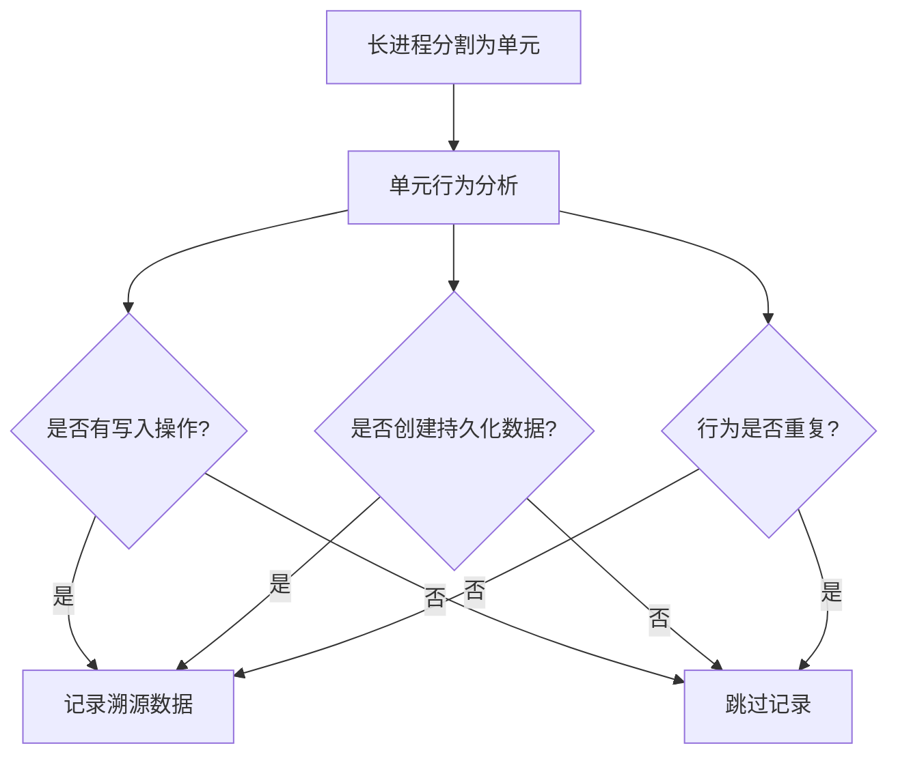
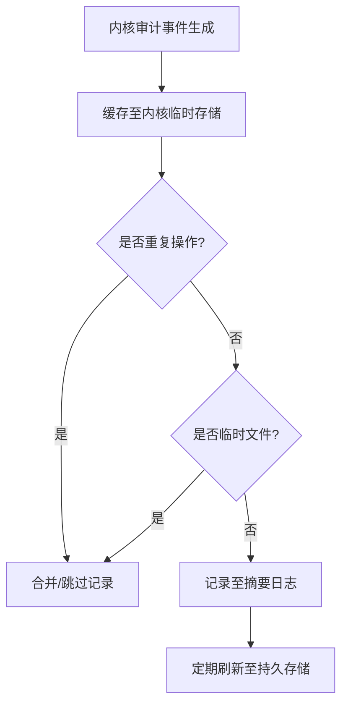

# 基于来源的入侵检测系统：综述

## 摘要

### 前提

- 传统的入侵检测系统（IDS）无法应对日益增多和复杂的网络攻击，例如高级持续威胁（APT）。
- 高误报率
- 需要专家验证

### 背景

- 数据来源将系统实体之间的信息流表示为直接无环图（DAG）。
- ==与传统入侵检测系统相比，基于来源的入侵检测系统利用数据来源来提高入侵检测性能，降低误报率==

> Provenance-based Intrusion Detection Systems (PIDS)

### 贡献

- 本调查通过对该领域最新研究的详细评估，提出了一种新的PIDS分类方法，讨论了当前的问题和潜在的未来研究方向，展示了PIDS的潜力。
- 该调查旨在通过解决数据收集、图摘要、入侵检测和开发真实世界基准数据集等问题，帮助和激励研究人员开始在PIDS领域开展工作。


## IDS

### 分类


### 优缺点

NIDS无法识别加密流量

HIDS需要部署在每个主机上，只能监视部署它的主机，并生成大量的事件日志。但是效果比NIDS高

签名的检测方法无法识别零日攻击

在线IDS用于检测，离线的用于取证

## 数据来源

> 数据来源(Data Provenance)指的是表示事件起源并解释事件如何以及为何达到当前状态的记录轨迹。
>
> 数据来源可以表示为DAG，即来源图。在该图中，系统实体表示为节点N，系统操作表示为有向边E。源图G可以总结为：G = （N， E）。
>
> 反向跟踪确定了源图g中感兴趣的节点n的记录跟踪。生成的子图trace_дraph包含指向节点n的所有节点和边。
>
> (因果关系分析)。因果关系分析确定在物源图G中给定的两个节点n1和n2是否存在因果关系。


在数据溯源、工作流分析等场景中，可用于回答 “某个结果 / 数据是由哪些上游步骤 / 数据生成的”。

```
算法: backward-tracing(G, n)
输入: 
  G: 完整溯源图，包含节点集合G.nodes和边集合G.edges
  n: 起始追踪节点
输出: 
  trace_graph: 从节点n开始的反向依赖子图

1: procedure backward-tracing(G, n)
2:   // 初始化追踪子图，包含节点和边的集合
3:   trace_graph ← (nodes = {}, edges = {})
4:   
5:   // 检查当前节点是否已在子图中，避免循环依赖
6:   if n ∉ trace_graph.nodes then
7:     // 将起始节点加入子图
8:     trace_graph.nodes.add(n)
9:     
10:    // 遍历原图中所有边，查找指向当前节点的边
11:    for each edge in G.edges do
12:      if edge.target_id = n.id then
13:        // 找到当前节点的一个上游节点
14:        source_node ← G.nodes[edge.source_id]
15:        
16:        // 将上游节点和边加入子图
17:        trace_graph.nodes.add(source_node)
18:        trace_graph.edges.add(edge)
19:        
20:        // 递归追踪上游节点的依赖
21:        upstream_trace ← backward-tracing(G, source_node)
22:        
23:        // 合并递归追踪结果到当前子图
24:        trace_graph.nodes ← trace_graph.nodes ∪ upstream_trace.nodes
25:        trace_graph.edges ← trace_graph.edges ∪ upstream_trace.edges
26:      end if
27:    end for
28:  end if
29:  
30:  // 返回构建好的依赖子图
31:  return trace_graph
32: end procedure
```


```python
1: procedure check-causal-relation(G, n₁, n₂)
2:   // 初始化追踪子图
3:   trace_graph ← (nodes = {}, edges = {})
4:   
5:   // 反向追踪：收集n₁的所有上游依赖
6:   trace_graph ← backward-tracing(G, n₁)
7:   
8:   // 正向追踪：收集n₁的所有下游影响
9:   forward_trace ← forward-tracing(G, n₁)
10:  
11:  // 合并正向和反向追踪结果
12:  trace_graph.nodes ← trace_graph.nodes ∪ forward_trace.nodes
13:  trace_graph.edges ← trace_graph.edges ∪ forward_trace.edges
14:  
15:  // 检查n₂是否在追踪子图中
16:  if n₂ ∈ trace_graph.nodes then
17:    return True
18:  else
19:    return False
20:  end if
21: end procedure
```

## PIDS

基于溯源的入侵检测系统（PIDS）利用数据溯源来检测入侵，不仅分析系统实体及其属性，而且在溯源图中分析系统实体的因果关系和信息流。

1. 数据收集
2. 图总结
3. 入侵检测
4. 基准数据集


### 数据收集


### 系统级数据来源捕获（DPC）系统

WINDOWS 和Linux和跨平台的

### Unit-level Data Provenance Capture (DPC) Systems

单元级数据来源通过将系统实体划分为单元来描述更细粒度的信息流，从而扩展了系统级数据来源。

### 指令级数据来源捕获（DPC）系统

指令级数据来源描述了系统实体之间的信息流，具有源自中央处理单元（CPU）指令的高保真因果关系。

缺点：开销大

### 总结


## PIDS

### 压缩方式

- Bit Compression-based Reduction
- Simplification-based Reduction
- Policy-based Reduction
- Grouping-based Reduction

用于PIDS的图汇总技术的缩减率.约简率是PIDS图摘要技术常用的评价指标，它表示通过提高存储和分析效率的技术去除了来源图中的多少节点和边。我们用这个评价指标来比较回顾的技术。

#### 基于位压缩的约简

- **逻辑**：遍历溯源图，识别那些 “共享子节点（child nodes）” 的节点集合。比如节点 A、B 都有子节点 C、D，就认为 A、B 存在可利用的共性 。

- **意义**：为后续编码压缩找 “相似性基础”，利用共享结构减少重复存储。

- **情况 1：子节点编号连续**
  若子节点编号是连续的（比如子节点编号为 5、6、7 ），**编码为 “第一个子节点编号 + 长度”** 。例如记录 “起始编号 5，长度 3”，就能替代存储 5、6、7 三个独立编号，大幅压缩空间 。
- **情况 2：子节点编号不连续**
  对于非连续的子节点（比如子节点编号为 5、7、10 ），**用 “当前子节点编号 - 前一个子节点编号” 的差值编码** 。比如 7 - 5 = 2，10 - 7 = 3，存储 [5, 2, 3] 就可还原原始编号，利用差值的 “小数值” 特性（通常差值比原始编号小，能用更少位数存储 ）压缩数据。如果数值大，可能很大（比如 `10001`、`10003`、`10007` ）

- **忽略节点与边的属性（nodes’ and edges’ properties are not considered）**

#### Simplification-based减少

##### LogGC


##### ProTarcer

**动态筛选有效日志、跳过冗余记录**.

1. ProTracer首先将长时运行进程划分为多个单元，并对执行读取操作的单元进行标记，标注其读取的数据源。这些单元的溯源数据仅在单元终止前执行任何写入操作时才会被记录.若某单元仅读取配置文件但不修改任何数据，其溯源轨迹不被记录。
2. ProTracer通过标记执行内部写操作的单位，避免了记录那些不会对系统产生永久性影响的无效事件。例如：进程 A 创建临时文件 temp.txt，但进程 B 未读取该文件，temp.txt 的创建轨迹不被记录
3. ProTracer通过标记与已记录单元行为相同的单元，避免了单元冗余记录。多个单元执行相同的 “数据清洗” 操作（输入文件相同、处理逻辑相同），仅记录第一个单元的溯源数据，后续单元跳过。





##### KCAL

KCAL（Kernel-supported Cost-effective Audit Logging）作为改进方案，通过**内核级在线摘要**直接在日志生成阶段实现优化，前者都是日志生成后审计



1. **实时拦截与缓存**：内核捕获审计事件后，先存入临时缓存而非直接写入磁盘；
2. **双重筛选**：通过冗余检测和临时文件判断，过滤无效事件；
3. **批量持久化**：有效日志定期刷新到磁盘，减少 IO 次数。

#### 基于策略的减少

##### Trusted Computing Base (TCB)

需要定义MAC策略

缺点：可能会错过旨在绕过预定义策略的攻击的数据来源。


#### Edge-grouping-based Reduction

##### Causality-Preserving Reduction (CPR)

CPR是基于只有少数关键事件对其他事件显示因果重要性的观察。因此，**可以删除不相关的事件，阴影事件可以与它们的关键事件聚合**


事件E3是一个不相关的事件，可以删除，因为它对取证分析中的前向追踪结果没有任何影响。

##### Process-centric Causality Approximation Reduction (PCAR)

PCAR基于这样的观察，即有些过程会产生强烈的突发事件，例如扫描文件或设备，这些事件在语义上相似，但由于其交错的因果关系，无法通过CPR来减少。


过程C是突发事件，虚线圆显示其邻居集，事件E3是近似阴影事件。即使事件E2具有交错的因果关系，它也可以与事件E2聚合。然而，事件E5和事件E6不能聚合，因为它们的交错事件E7是邻居集之外的信息流。

连续依赖（CD）、完全依赖（FD）和源依赖（SD）保存可以通过考虑全局上下文进一步提高空间开销减少率

##### Continuous Dependence (CD)


##### Full Dependence (FD)


##### Source Dependence (SD)


| **维度**     | **连续依赖保留（CD）**               | **完全依赖保留（FD）**                 |
| ------------ | ------------------------------------ | -------------------------------------- |
| **保留目标** | 连续未中断的依赖链                   | **完整的全链路依赖（含末端节点）**     |
| **适用场景** | 关注核心流程的依赖，末端节点不重要时 | 需保证全链路完整性（如涉及最终输出）   |
| **约简力度** | 中等（保留连续链，过滤并行冗余）     | 中等偏轻（需保留末端依赖，冗余更谨慎） |
| **典型案例** | 中间数据处理流程的溯源优化           | 涉及最终结果输出的溯源分析（如审计）   |


##### Graaf


#### Node-grouping-based Reduction

##### NodeMerge 

首先，创建频繁访问模式（FAP）；其次，基于优化的频繁模式（FP）增长算法从 FAP 中自动学习模板；最后，使用这些模板压缩后续的事件数据


##### Winnower


在集群的**每个工作节点（worker node）** 上，生成**抽象溯源图**。

用 **确定有限状态自动机（DFA，Deterministic Finite State Automata）学习**，把抽象溯源图转成 **行为模型（behavior model）**，本质是生成 **图语法（graph grammar）**

在 **主节点（master node）** 上，把所有 worker 节点的行为模型 **聚合（aggregate）** 成 **统一模型（unified model）**，再同步回所有 worker 节点。

给统一模型的**每个节点（图结构里的实体节点）** 加上 **置信度（confidence level）**，反映 “多少 worker 节点有此行为”

> - 高置信度（如节点 A - C ）：多数 worker 都有该行为 → 判定为**正常集群行为**。
> - 低置信度（如节点 D - E ）：只有少数 / 单个 worker 有该行为 → 疑似**异常 / 恶意行为**（需进一步分析 ）。

worker 节点采集**新的溯源数据**时，先拿统一模型验证：

- 若匹配 → 行为正常，无需处理；
- 若不匹配 → 更新本地行为模型，再上报给 master 节点重新聚合，保证模型动态适配集群变化。


### IND 入侵检测


#### 基于异常的入侵检测

##### 序列学习。

序列学习方法基于起源图中良性事件的因果顺序建立模型。然后，该模型用于预测给定事件序列的下一个事件。预测事件与实际事件的偏差表明潜在的恶意事件。

##### 图嵌入

图嵌入技术将节点、边及其属性转换为向量，同时保留属性，例如来源图的结构。接下来，向量空间的传统异常检测方法可以应用于检测恶意行为。

SIGL 是一套 **“溯源图→向量空间→异常检测”** 的方案，核心解决 “如何识别新软件安装是良性（正常）还是恶意（异常）” 的问题，

ProvDetector [106] 是一种基于溯源图的恶意行为检测方法，核心通过 “**筛选稀有路径 + 向量表示 + 异常检测**” 实现对系统行为的恶意性判断。

> **Local Outlier Factor（LOF）算法**：一种基于密度的异常检测方法，核心思想是计算每个样本点与邻居的密度差异.LOF 值越高，说明该路径与周围正常路径的差异越大，越可能是异常（恶意）路径。

另一种方法使用通用和特定来源的网络度量来总结大型复杂来源图的有意义的信息和知识作为向量,有也就是将大型复杂的溯源图（Provenance Graph）转化为可计算的向量，通过网络指标提取图的结构和语义特征，再利用机器学习分类器识别恶意行为。

1. **指标提取**：从溯源图中计算上述通用和特定指标，组成特征向量。

2. **向量表示**：将图转化为多维向量（如 “节点数 + 边数 + MFD + 聚类系数” 等构成的向量）。

3. 模型训练

   ：用决策树分类器（Decision Tree Classifier）学习向量特征与恶意性的关联：

   - 输入：标注好的正常 / 恶意溯源图的指标向量。
   - 输出：训练好的模型，可对新图的向量预测恶意概率。

##### 聚类

基于聚类的溯源图分析旨在将**行为相似的节点（如进程、文件等系统实体）归为同一簇**，通过识别异常簇（与正常簇差异显著）来检测潜在的恶意行为。其核心假设是：**正常系统行为的节点交互模式具有聚类规律性，而恶意行为会形成异常簇**。

##### 异常因子

频繁模式异常因子（FPOF）根据预定义的阈值确定数据集中对象属性的频繁模式。然后，对象的异常分数由它包含的异常模式的数量计算。异常分数较低的对象将被视为可能的异常

> APT 攻击的行为模式可能罕见

离群度（OD）首先确定数据集中对象属性的频繁模式，其次是描述不同模式关联的高置信度规则。例如，如果对象o1包含模式p1，那么它也必须包含模式p2。然后，通过对每个对象应用高置信度规则对其进行评分。高分对应于高异常可能性。

1. 先识别数据集中的频繁模式，再生成**高置信度关联规则**（如 “若对象含模式 p1，则必含 p2”）。
2. 对每个对象，应用规则计算**违反规则的次数**：违反次数越多 → 异常分数越高 → 越可能是攻击。

> 规则 “合法软件安装必含‘注册表写入 p1’和‘文件复制 p2’”，若某安装行为只含 p1 不含 p2，OD 分数高，判定为异常。

属性值频率（AVF）确定单个属性的频率编号，然后通过将特定对象中实际属性的概率相加来对数据集中的每个对象进行评分。因此，较低的分数表示罕见的属性，这意味着可能存在异常。

> 正常网络连接多使用 80/443 端口（高概率），若某连接使用端口 8081（低概率），AVF 分数低，提示潜在恶意通信。

#### 基于规则的入侵检测

AIQL以离线出处图为目标，SAQL以流式出处图为目标。

#### Tag-propagation-based入侵检测

SLEUTH[49]为来源图中的节点分配可信度和机密性标签，并通过检查预定义的策略来检测入侵。

### 基准数据集


#### 公开数据集


基本全是合成的数据

#### 数据集的问题

- 缺少真实的数据集
- 良性流量是合成的
- 缺少文档和工具

#### 自制数据集


## 结论

我们确定的主要研究问题有：

(1)数据来源捕获系统收集细粒度数据来源带来的高运行时开销；

(2)数据来源的隐私问题，这使得跨企业的数据共享成为不可能；

(3)缺乏可扩展的图摘要技术；

(4)缺乏利用无损和有损降低技术的图摘要技术；

(5)缺乏自动适应当前场景的鲁棒实时入侵检测方法；

(6)缺乏真实世界的基准数据集来评估图摘要和入侵检测方法。